# MedGraphRAG: An Advanced, Evidence-Based Medical AI

<p align="center">
  
  
  
  
</p>

**MedGraphRAG** is a sophisticated, adaptive Retrieval-Augmented Generation (RAG) system built for the high-stakes domain of medical knowledge. It goes beyond standard RAG by structuring information into a multi-layered knowledge graph, enabling it to provide responses that are not only accurate but also transparent, verifiable, and grounded in evidence.

This project serves as a production-grade blueprint for building reliable AI systems in critical domains.

## Key Architectural Innovations

This system is built on four pillars that distinguish it from conventional RAG chatbots:

#### 1. High-Level Application Logic and Knowledge Lifecycle
The MedGraphRAG ecosystem is divided into two main parts: the **Online Runtime Graph** that handles user queries in real-time, and the **Offline Knowledge Lifecycle** that ingests, organizes, and curates the knowledge base.


### Detailed System Components and Data Flow
The following diagram provides a more granular view of the system components, their interactions, and the flow of data through the various processing pipelines and the Neo4j database:

```mermaid
graph TD
    %% === External Data & User ===
    subgraph ExternalData [External Data & User]
        direction LR
        User((User))
        PDFs["📄 PDF Files (data/)"]
        Websites["🌐 Trusted Websites (WHO, NIH)"]
        MockData["🧪 Mock UMLS/Paper Data"]
    end

    %% === Data Processing & Ingestion Pipelines ===
    subgraph IngestionPipelines [Data Processing & Ingestion Pipelines]
        direction TB
        PopulateRepo["populate_repository_graph.py"]
        Ingest["ingest.py"]
        KnowledgePipeline["knowledge_pipeline.py"]

        PopulateRepo --> ProcessedPopulateRepoLog{{"(creates GDS indexes & initial entities)"}}

        Ingest --> ProcessedPDFsLog["📄 db/processed_files.log"]

        KnowledgePipeline --> PendingReviewJsonl["📝 pending_review.jsonl"]
        KnowledgePipeline --> ProcessedURLsLog["🌐 processed_urls.log"]

        PendingReviewJsonl --> ManualReview["🧑‍💻 Manual Review & Ingestion into Neo4j"]
    end

    %% === Neo4j Graph Database ===
    subgraph Neo4jDatabase [Neo4j Graph Database]
        direction LR
        Neo4jDB["((Neo4j DB))"]

        subgraph Entities [Knowledge Entities]
            direction TB
            MetaGraphs["MetaMedGraph (Doc Chunks)"]
            RAGEntities["RAG_Entity (Chunk Entities)"]
            UMLS["UMLS_Entity (Vocabulary)"]
            Papers["Paper_Entity (Literature)"]
        end

        subgraph Tags [Tag Hierarchy]
            direction TB
            TagSum["TagSummary (L0 Tags)"]
            AbstractTags["AbstractTag (L1+ Tags)"]
        end

        GDSIdx["GDS Vector Indexes (umls-embeddings, paper-embeddings)"]

        %% Neo4j Internal Structure
        MetaGraphs -.-> GDSIdx
        RAGEntities -.-> GDSIdx
        UMLS -.-> GDSIdx
        Papers -.-> GDSIdx
        TagSum -.-> GDSIdx
        AbstractTags -.-> GDSIdx

        MetaGraphs -- "contains" --> RAGEntities
        RAGEntities -- "linked_to (via GDS)" --> UMLS
        RAGEntities -- "linked_to (via GDS)" --> Papers
        MetaGraphs -- "HAS_TAG_SUMMARY" --> TagSum
        AbstractTags -- "SUMMARIZES" --> TagSum
        AbstractTags -- "SUMMARIZES" --> AbstractTags


        Neo4jDB ~~~ MetaGraphs & RAGEntities & UMLS & Papers & TagSum & AbstractTags & GDSIdx
    end

    %% === Tagging Pipeline ===
    subgraph Tagging [Tagging Pipeline]
        TaggingPipeline["tagging_pipeline.py"]
    end

    %% === Application Layer ===
    subgraph Application [Application Layer]
        direction TB
        App["app.py (Streamlit UI)"]
        MedGraphRAG["src/graph.py (WeightManagementGraph)"]
        GoogleSearchTool["🛠️ Google Search (via LLM Tool)"]
    end

    %% === Data Flows ===
    %% Populate Repo
    MockData --> PopulateRepo
    PopulateRepo -- "writes" --> Neo4jDB

    %% Ingest PDFs
    PDFs --> Ingest
    Ingest -- "writes" --> Neo4jDB

    %% Knowledge Pipeline
    Websites --> KnowledgePipeline
    ManualReview -- "writes" --> Neo4jDB

    %% Tagging Pipeline
    TaggingPipeline -- "reads/writes" --> Neo4jDB

    %% Application
    User -- "interacts" --> App
    App -- "delegates to" --> MedGraphRAG
    MedGraphRAG -- "reads from" --> Neo4jDB
    MedGraphRAG -- "uses" --> GoogleSearchTool
    MedGraphRAG -- "responds to" --> App

    classDef default fill:#f9f9f9,stroke:#333,stroke-width:2px;
    classDef db fill:#D6EAF8,stroke:#2980B9,stroke-width:2px;
    classDef script fill:#E8F8F5,stroke:#1ABC9C,stroke-width:2px;
    classDef file fill:#FEF9E7,stroke:#F1C40F,stroke-width:2px;
    classDef user fill:#FADBD8,stroke:#C0392B,stroke-width:2px;
    classDef tool fill:#EBDEF0,stroke:#8E44AD,stroke-width:2px;
    classDef manual fill:#F5EEF8,stroke:#A569BD,stroke-width:2px;

    class User user;
    class PDFs,Websites,MockData,PendingReviewJsonl,ProcessedPDFsLog,ProcessedURLsLog file;
    class PopulateRepo,Ingest,KnowledgePipeline,TaggingPipeline,App,MedGraphRAG script;
    class Neo4jDB,GDSIdx,MetaGraphs,RAGEntities,UMLS,Papers,TagSum,AbstractTags db;
    class GoogleSearchTool tool;
    class ManualReview manual;
    class ProcessedPopulateRepoLog file;

```


2. Triple Graph Construction
Our knowledge base is a three-tiered graph in Neo4j, ensuring maximum reliability:
Layer 1 (RAG Data): Knowledge extracted from your private documents.
Layer 2 (Literature Repository): A trusted library of entities from medical papers and textbooks.
Layer 3 (Controlled Vocabulary): A foundational layer of formal definitions from medical ontologies like UMLS.
This structure enriches every piece of information with verifiable sources and definitions.
3. Hierarchical Knowledge Organization & U-Retrieval Strategy
We don't just dump vectors into a database. The system summarizes document chunks with medical tags, then uses an offline clustering process to build a multi-level semantic hierarchy. This enables a novel, two-phase retrieval process that mimics expert reasoning:


4. Human-in-the-Loop Governance
No knowledge enters the trusted graph without expert approval. A dedicated review tool allows a human to validate all AI-generated propositions and user feedback, ensuring the system's safety and integrity.
Tech Stack
| Component      | Technology                  | Purpose                                                                              |
|----------------|-----------------------------|--------------------------------------------------------------------------------------|
| Orchestration  | LangChain & LangGraph       | Manages the complex, stateful agent workflow.                                        |
| LLM            | Google Gemini               | Provides the core generative and reasoning capabilities.                             |
| Frontend       | Streamlit                   | A simple, interactive web interface for the user.                                    |
| Graph Database | Neo4j & GDS Library         | Stores the structured knowledge graph and performs high-speed vector searches.       |
| Embeddings     | HuggingFace all-MiniLM-L6-v2 | Generates vector representations of text for semantic understanding.                 |
| External Tools | BioPython (Entrez)          | Fetches real-time data from the PubMed scientific database.                          |

🚀 Getting Started: A Three-Stage Workflow
To get MedGraphRAG running, you must follow these three stages in order.
Stage 1: System Setup
This stage prepares your environment.
1. Clone the Repository:

```bash
git clone https://github.com/YOUR_USERNAME/medgraphrag.git
cd medgraphrag
```

2. Install Dependencies:
It's highly recommended to use a virtual environment.
```bash
python3 -m venv venv
source venv/bin/activate
pip install -r requirements.txt
```
3. Configure Neo4j with Graph Data Science (GDS):
This is a critical step. The application will not work without the GDS plugin.
```bash
docker run \
    --name neo4j-medgraphrag \
    -p 7474:7474 -p 7687:7687 \
    -d \
    --env NEO4J_AUTH=neo4j/your_password \
    --env NEO4J_PLUGINS='["graph-data-science"]' \
    neo4j:latest
```
Note: Replace your_password with a strong password.
4. Configure Environment Variables:
Copy the template and fill in your credentials.
```bash
cp .env.example .env
```
Open the new .env file and add your `GOOGLE_API_KEY` and the `NEO4J_PASSWORD` you just created.

The `.env.example` file lists all configurable variables. Key ones include:
*   `GOOGLE_API_KEY`: Your Google API key for Gemini.
*   `LLM_MODEL`: The specific Gemini model to use (e.g., "gemini-1.5-flash-latest").
*   `NEO4J_URI`: Connection URI for your Neo4j instance.
*   `NEO4J_USERNAME`: Username for Neo4j.
*   `NEO4J_PASSWORD`: Password for Neo4j.
*   `ENTREZ_EMAIL` & `ENTREZ_API_KEY`: For PubMed search tool.
*   `MAX_CONCURRENT_GEMINI_CALLS`: (Optional) The maximum number of concurrent calls to the Gemini API during data ingestion. Defaults to 5. This helps manage API rate limits and system load.

Stage 2: Knowledge Base Construction
This is the core offline process where you build the AI's brain.
Step 2.1: Populate the Foundational Repository (One-Time Task)
This script populates Neo4j with trusted medical literature and vocabularies (Layers 2 & 3). It includes sample data to run immediately.
```bash
python populate_repository_graph.py
```
(You will be asked to confirm before the script clears your database.)
Step 2.2: Ingest Your Private Documents
Place your own PDF documents (e.g., internal research, textbooks) into the data/ directory. Then, run the ingestion script to process them into the knowledge graph (Layer 1).
```bash
python ingest.py
```
Step 2.3: Build the Retrieval Hierarchy
This script tags your documents and then builds a multi-level semantic hierarchy for efficient retrieval. The process is split into two parts:

1.  **Tagging New Documents**: This step identifies documents that haven't been tagged yet and generates tags for them.
2.  **Building/Updating the Hierarchy**: This is a more intensive clustering process that organizes the tags into a hierarchy.

To tag any new documents, run:
```bash
python tagging_pipeline.py
```
This command will only perform the tagging of new documents.

To run the full, expensive clustering process to build or update the tag hierarchy, use the `--build-hierarchy` flag:
```bash
python tagging_pipeline.py --build-hierarchy
```
This is typically a periodic maintenance task, not something you need to run every day.
Stage 3: Run the Application
Once the knowledge base is built, you can start the interactive application.
```bash
streamlit run app.py
```
Navigate to the local URL provided by Streamlit (e.g., http://localhost:8501) to start chatting with MedGraphRAG.
🔄 The Self-Improvement Workflow
MedGraphRAG is designed to evolve. The workflow is managed by three key scripts:
knowledge_pipeline.py (Proactive Discovery):
What it does: Automatically scans trusted websites for new articles on topics of interest.
Output: Generates Q&A "propositions" and saves them to pending_review.jsonl.
How to run:
```bash
python knowledge_pipeline.py
```
 (e.g., as a nightly cron job).
expert_review_tool.py (Human Governance):
What it does: A command-line interface for a subject matter expert to review all new knowledge sources: propositions from the pipeline, and user feedback from the app.
How to run:
```bash
python expert_review_tool.py
```
The Magic: When you approve an item, it's not just saved—it's fully processed through the entire ingest.py pipeline, ensuring it becomes a native, structured part of the knowledge graph.
tagging_pipeline.py (Re-organization):
After approving new knowledge with the review tool, you should re-run the tagging pipeline to integrate the new information into the retrieval hierarchy.
This loop ensures that the AI's knowledge base grows over time while maintaining the highest standards of accuracy and safety.
Contribution
We welcome contributions! Please feel free to submit a pull request or open an issue for bugs, feature requests, or improvements.
License
This project is licensed under the MIT License. See the LICENSE file for details.
